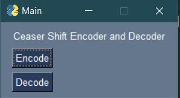
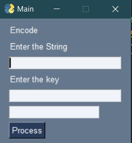

# Ceaser_Shift_Decode_Encoder
A Simple GUI Application for Decoding and Encoding Ceaser Ciphers

ScreenShots

<h1>Instalation</h1>
 ->Clone The repository
 ->Make it into an executable using auto-py-to-exe
